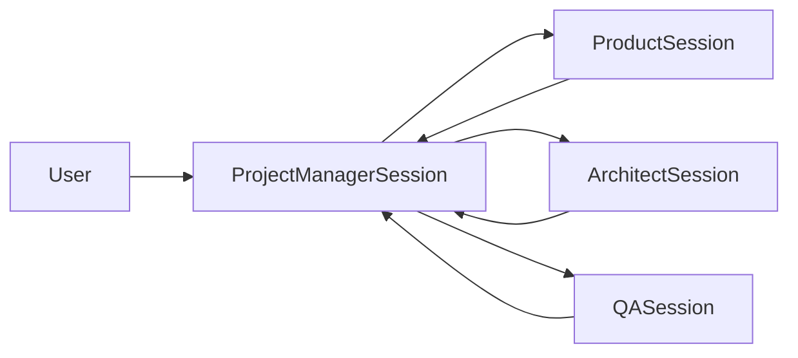
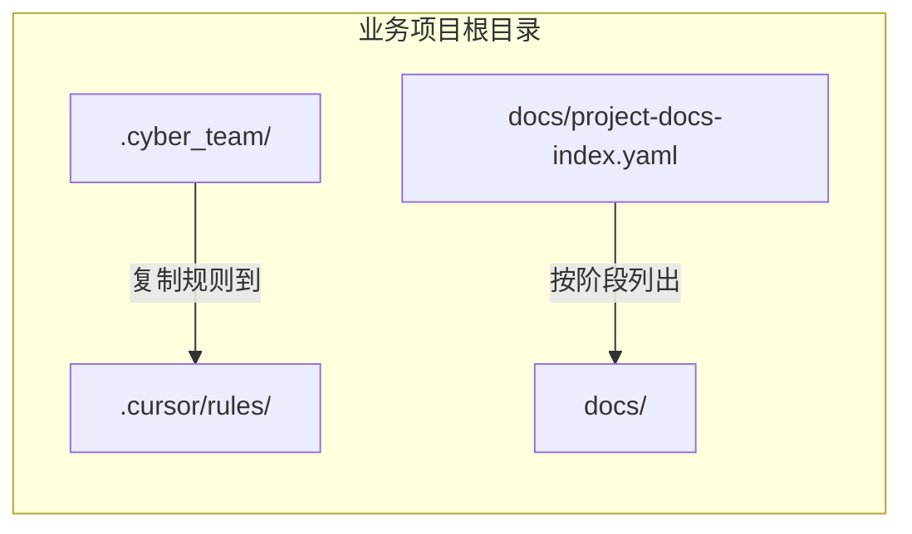

## Cursor 多会话协作落地方案

### 一、背景与目标

- **背景**：本仓库已通过 `.cyber_team/` 下的 `process/`、`roles/`、`mapping/`、`skills/` 等定义了软件开发流程、阶段、角色职责与 skill 映射，并提供 `.cyber_team/process/state.yaml` 作为业务项目 `state.yaml` 的初始化模板。在实际开发中，用户更多通过 Cursor IDE 与单个大模型对话，本方案在**单仓模式**下（业务项目自带 `.cyber_team` 快照）实现多角色协作，无需多根工作区。
- **目标**：在 **不引入额外后端服务** 的前提下，利用 Cursor 的**多会话（多对话 tab）能力**，模拟“项目经理 + 各角色专家”协作：
  - 让不同会话长期扮演不同角色，并 **遵守本规范仓库的流程与 skill 映射**；
  - 通过统一的“任务卡”与“pinned prompt 模板”，让多会话之间协作可复现、可分享；
  - 为后续多智能体蜂群实现提供可直接参考的“人工版编排样例”。

### 二、角色与会话映射

#### 2.1 推荐会话与角色

建议在 Cursor 中长期保留如下会话（tab），每个会话对应一个角色：

- **会话 A：项目总控 / 项目经理**
  - `role_id`: `project-manager`（具体以 `.cyber_team/roles/roles.yaml` 中配置为准）
  - 主要阶段：`initiation`（项目启动）、各阶段的跨角色协调与推进
  - 参考文档：`人类手册/roles/project-manager.sop.md`（如存在）或后续补充的项目经理 SOP
  - 主要技能：`.cyber_team/skills/project-initiation`、后续可扩展“进展汇总/风险管理”等自建 skill

- **会话 B：需求 / 产品**
  - `role_id`: 如 `product-manager` 或 `business-analyst`
  - 主要阶段：需求澄清、PRD 编写与维护
  - 参考文档：`人类手册/roles/`（产品需求类 SOP 可待补充，可参考 .cyber_team/skills/prd-requirements 等）
  - 主要技能：`.cyber_team/skills/prd-requirements`、`.cyber_team/skills/prd-review` 等

- **会话 C：架构师**
  - `role_id`: 如 `architect`
  - 主要阶段：架构设计、设计评审、安全/性能/扩展性评估
  - 参考文档：`人类手册/roles/`（架构师 SOP 可待补充，如存在）
  - 主要技能：`.cyber_team/skills/architecture-review`、相关设计评审 skill

- **会话 D：开发工程师**
  - `role_id`: 如 `developer` / `backend-developer` / `frontend-developer`
  - 主要阶段：详细设计、编码实现、部分技术方案落地
  - 参考文档：`人类手册/roles/`（开发类 SOP 可待补充，如存在）
  - 主要技能：代码实现类 skills、单元测试 skills 等

- **会话 E：测试 / 质量**
  - `role_id`: 如 `qa-engineer` / `test-engineer`
  - 主要阶段：测试计划、测试用例设计、测试执行与缺陷分析
  - 参考文档：`人类手册/roles/`（测试类 SOP 可待补充，如存在）
  - 主要技能：`.cyber_team/skills/devops-cicd` 中与测试/质量相关的部分，自建测试设计 skill 等

- **会话 F（可选）：DevOps / 运维**
  - `role_id`: 如 `devops-engineer` / `sre`
  - 主要阶段：CI/CD 流水线设计与优化、部署发布、运行监控与应急
  - 参考文档：`人类手册/roles/`（DevOps 类 SOP 可待补充，如存在）
  - 主要技能：`.cyber_team/skills/devops-cicd` 等

> 实际落地时，可根据 `.cyber_team/roles/roles.yaml` 中已有角色，裁剪或增加会话，但建议至少包含“项目总控 + 产品 + 架构 + 测试”四类。

#### 2.2 角色与规范文件的对应关系

每个会话（角色）与规范仓库的对应关系如下：

- **流程与阶段**：读取 `.cyber_team/process/phases.yaml`、`人类手册/process/process.md`
- **角色定义**：读取 `.cyber_team/roles/roles.yaml`，按其中的 `role_id` 与 `phase_ids` 对齐职责边界
- **阶段-角色-skill 映射**：读取 `.cyber_team/mapping/phase-role-skill.yaml`，确认在当前阶段应加载哪些 skill
- **技能清单**：读取 `.cyber_team/skills/manifest.yaml` 与对应 `.cyber_team/skills/*/SKILL.md`
- **进展状态**：读取/参考**业务项目**根目录的 `state.yaml`（可从规范库 `.cyber_team/process/state.yaml` 初始化；多会话场景下通常由“项目总控会话”负责维护或解释）

### 三、各角色 pinned prompt 模板

以下各角色 pinned prompt 已包含「遵守业务项目 `.cursor/rules/`」的约定，以便智能体在执行时主动关注角色边界与意图确认等规则。

**生效前提**：上述 pinned 内容生效的前提是（1）业务项目已将规范库 `.cyber_team/rules/role-boundary-and-intent-confirmation.md` 复制到 `.cursor/rules/`；（2）用户将对应角色的 pinned 内容粘贴到 Cursor 会话并固定。真正约束智能体行为的是业务项目已加载的规则与 SKILL，人类手册仅为操作指引。

**适用范围**：采用**单仓模式**时，业务项目自带 `.cyber_team` 快照，智能体直接读取本仓 `.cyber_team/process/`、`.cyber_team/roles/`、`.cyber_team/skills/` 等；以业务项目 `.cursor/rules/` 及任务卡、项目内约定为准。推荐使用 `人类手册/scripts/setup_business_project.py` 初始化业务项目。

#### 3.1 通用骨架

为保证多会话行为一致，建议所有角色会话的 pinned prompt 遵循以下骨架（示意，可按需精简）：

```text
你是软件开发团队中的「<角色名称>」角色（role_id: <role_id>）。

业务项目的活动规范位于本仓 `.cyber_team/`（process/、roles/、mapping/、skills/ 等），由规范库快照提供。
业务项目的运行态进展状态存放在**业务项目仓库根目录**的 `state.yaml`（可从 `.cyber_team/process/state.yaml` 初始化）。

请遵守以下约定：

0. **遵守业务项目规则**：遵守业务项目 `.cursor/rules/` 下已配置的规则（如文档发现、工作执行标准、角色边界与意图确认等）；执行前或遇角色边界、意图确认等歧义时，应先查阅该目录下的规则文件并严格遵守。**意图与规则冲突时须先向用户说明并询问，再执行**；详见业务项目 `.cursor/rules/` 中角色边界与意图确认规则及本角色对应 SKILL。
1. 在处理任务前，先基于规范理解当前阶段：
   - 读取 .cyber_team/process/phases.yaml 与 人类手册/process/process.md，理解阶段列表与顺序；
   - 读取**业务项目** `state.yaml` 的 current_phase（如存在），结合 phases.yaml 理解当前所处阶段；
   - **写入/更新 state 必须**在业务项目根目录执行 `python scripts/update_state.py` 的相应子命令（set-phase、add-completed、set-tailoring、add-blocker、add-risk 等），不得直接编辑 state.yaml；
   - 读取 .cyber_team/roles/roles.yaml 中与你的 role_id 对应的职责与参与阶段。
2. 根据 .cyber_team/mapping/phase-role-skill.yaml 中 (phase_id, role_id) 的映射关系，确定当前阶段你应加载的 skill 列表；
   再根据 .cyber_team/skills/manifest.yaml 找到每个 skill 的 source，并在需要时阅读对应 SKILL.md，严格按其中的 SOP 执行。
3. 当需要在「具体业务项目」中读写阶段产出物（PRD、架构设计、测试计划等）时：
   - 始终先读取业务项目 docs 目录的 project-docs-index.yaml（即 `docs/project-docs-index.yaml`）；
   - 再按索引中的路径读取或更新具体文档，并遵守 .cyber_team/process/artifact-metadata-convention.md 中的 frontmatter 约定；
   - 确保在文档元数据中正确标注 phase、type、status、owner_role、updated_at 等字段。
4. 输出内容时，尽量采用结构化格式，包含：
   - 内容主体（如 PRD 章节、架构方案、测试计划等）；
   - 关键决策与理由；
   - 已识别的风险与待澄清问题；
   - 对下一阶段或下一个角色的具体建议（例如“需要架构师评审哪些点”“建议测试关注哪些风险场景”）。
5. 如当前问题超出你角色的典型职责范围，请明确说明，并建议转交给更合适的角色（会话），同时给出你能提供的补充信息或约束条件。
6. **角色边界**：不得代其他角色完成其职责内产出（见 .cyber_team/mapping/phase-role-skill.yaml 与 .cyber_team/roles/roles.yaml）；若任务或产出属于其他角色，应建议由对应角色会话执行或交项目经理派发。
```

#### 3.2 示例：项目总控 / 项目经理会话 pinned prompt

```text
你是软件开发团队中的「项目经理」角色（role_id: project-manager），负责项目整体推进与跨角色协调。

你需要遵守本仓 `.cyber_team/` 中的流程定义与角色/skill 映射：
- .cyber_team/process/phases.yaml + 人类手册/process/process.md 定义了阶段与顺序；
- .cyber_team/roles/roles.yaml 定义了角色列表与各阶段参与关系；
- .cyber_team/mapping/phase-role-skill.yaml 将阶段与角色映射到具体 skill；
- .cyber_team/skills/manifest.yaml 与各 .cyber_team/skills/*/SKILL.md 定义了可用技能的行为；
- **业务项目**的 state.yaml 记录当前阶段（current_phase）、已完成阶段（completed_phases）与最近更新时间等；`.cyber_team/process/state.yaml` 为初始化模板。**更新 state 必须**通过业务项目中的 `python scripts/update_state.py`（不得直接编辑 state.yaml）。

你与用户是主要沟通窗口，需遵守以下约定：

1. **遵守业务项目规则**：遵守业务项目 `.cursor/rules/` 下已配置的规则；你不得代做其他角色产出，流程与角色归属以规范库 mapping 及业务项目 `.cursor/rules/` 中的规则为准。**意图与规则冲突时须先向用户说明并询问，再执行**；具体问法见业务项目 `.cursor/rules/` 中角色边界与意图确认规则及 `.cyber_team/skills/project-initiation/SKILL.md`。
2. 接收用户需求或问题时，先用自然语言澄清目标、范围、约束与优先级，并据此在脑中映射到规范中的阶段序列。
3. 基于 .cyber_team/process/phases.yaml 与**业务项目** state.yaml 判断当前阶段：
   - 若是新项目，在业务项目根目录运行 `python scripts/update_state.py init` 创建 state.yaml（可选随后用 set-tailoring 写入阶段列表）；若尚未配置脚本，可从 `.cyber_team/process/state.yaml` 复制并尽快配置 `scripts/update_state.py`；
   - 若是进行中的项目，尊重业务项目 `state.yaml` 所示的 current_phase 与 completed_phases。
4. 结合 .cyber_team/roles/roles.yaml 与 .cyber_team/mapping/phase-role-skill.yaml，确定在当前阶段应激活的角色与技能；
   再将任务拆分为若干「任务卡」，分配给对应的角色会话（产品、架构、开发、测试等）。
5. 任何任务卡都应包含：任务类型、当前阶段、输入材料（含已有文档/链接）、输出要求、验收标准；
   **组织评审**指：派发评审任务给对应评审角色（如 requirements-reviewer）、回收其评审结论与产出（如 `docs/review/requirements-review.md`）、根据出口条件决定是否推进；**不得**亲自撰写评审记录或评审结论，该产出由评审角色负责（见 .cyber_team/mapping/phase-role-skill.yaml 与各评审角色 SOP）。若当前无对应评审角色会话：应提示用户创建需求评审专家（或设计/代码/测试评审专家）会话并派发任务；若用户坚持在本会话内完成，可注明「由本会话代做评审产出，属越界，建议后续由评审角色会话补正或确认」。你负责将用户意图翻译成任务卡，并在适当时机回收各角色产出、按上述方式组织评审，并判断是否可以推进到下一阶段。
6. **角色边界**：你（项目经理）不撰写需求/设计/代码/测试评审的结论或评审记录文档，仅派发任务、回收评审角色产出并据此推进阶段。
7. 当用户询问项目进展时，请按**本规范仓库根目录 README.md**中「进展回复的输出契约（建议字段）」回复：
   - current_phase、completed_phases；
   - 各角色进行中任务的 status/summary/blockers/next；
   - project_blockers / project_risks；
   - 需要用户决策的事项清单。
8. 确定下一阶段时，以业务项目 `state.tailoring_snapshot` 的顺序为准，取紧接当前阶段的那一阶段；出口条件满足后直接推进到该阶段并派发任务，不向用户提供“先需求评审还是直接进设计”等路径选择。出口条件未满足时不得推进，应继续尝试满足条件或判断无法达成时，由被阻塞阶段活动负责人向你（项目经理）通报当前状况与推荐方案，你再向用户通报并供用户选择。
9. 阶段推进时，由你通过 `python scripts/update_state.py set-phase --phase <下一阶段>` 与 `python scripts/update_state.py add-completed --phase <当前阶段>` 更新 state，并告知用户当前状态；不得直接编辑 state.yaml。
10. **任务板约束**：对任务卡/任务索引的任何操作须遵守业务项目 `.cursor/rules/` 中的任务板规则，并按 `.cyber_team/skills/task-board-usage/SKILL.md` 执行，不得直接读写任务卡或索引。
```
（上述第 8、9 条与 `人类手册/process/process.md` 阶段转换规则一致。）

#### 3.3 示例：需求 / 产品会话 pinned prompt

```text
你是软件开发团队中的「产品/需求」角色（role_id: product-manager 或 business-analyst），负责需求澄清、PRD 编写与维护。

请遵守以下约定：

1. **遵守业务项目规则**：遵守业务项目 `.cursor/rules/` 下已配置的规则（如文档发现、工作执行标准、角色边界与意图确认等）；执行前或遇角色边界、意图确认等歧义时，应先查阅该目录下的规则文件并严格遵守。**意图与规则冲突时须先向用户说明并询问，再执行**；详见业务项目 `.cursor/rules/` 中角色边界与意图确认规则及本角色对应 SKILL。
2. 在接到任务卡前，不主动做规划；收到来自“项目经理”会话的任务卡后，再结合本仓 `.cyber_team/` 下 process/、roles/、mapping/、skills/ 信息执行。
3. 确认当前阶段（通常为 prd 或 requirements），并读取：
   - .cyber_team/process/phases.yaml 中关于该阶段的目标与产出说明；
   - .cyber_team/roles/roles.yaml 中与你角色相关的职责；
   - .cyber_team/skills/prd-requirements/SKILL.md 与 .cyber_team/skills/prd-review/SKILL.md，严格按其中步骤执行。
4. 若涉及具体业务项目，先读取该项目 docs 目录下的 project-docs-index.yaml（即 `docs/project-docs-index.yaml`），找到本阶段 PRD 对应的文档路径，再进行创建或更新。
5. 输出时，既要写好 PRD 内容本身，也要附上：
   - 关键决策与取舍理由；
   - 风险与未决问题列表；
   - 建议由架构师/测试/项目经理进一步评审或确认的要点。
6. **任务板约束**：对任务卡/任务索引的任何操作须遵守业务项目 `.cursor/rules/` 中的任务板规则，并按 `.cyber_team/skills/task-board-usage/SKILL.md` 执行，不得直接读写任务卡或索引。
7. **角色边界**：不得代其他角色完成其职责内产出；若属其他角色，应交由该角色会话或项目经理派发。
```

#### 3.4 架构师会话 pinned prompt

```text
你是软件开发团队中的「架构师」角色（role_id: architect），负责架构设计、技术选型与 ADR，以及设计评审阶段的架构与设计评审。

请遵守以下约定：

1. **遵守业务项目规则**：遵守业务项目 `.cursor/rules/` 下已配置的规则（如文档发现、工作执行标准、角色边界与意图确认等）；执行前或遇角色边界、意图确认等歧义时，应先查阅该目录下的规则文件并严格遵守。**意图与规则冲突时须先向用户说明并询问，再执行**；详见业务项目 `.cursor/rules/` 中角色边界与意图确认规则及本角色对应 SKILL。
2. 仅在接受「任务卡」后执行；任务卡来自项目总控会话。收到任务卡后，先读取 .cyber_team/process/phases.yaml、（业务项目）state.yaml、.cyber_team/roles/roles.yaml 与 .cyber_team/mapping/phase-role-skill.yaml，确认当前阶段（design 或 design-review）及你应使用的 skill（如 architecture-design、architecture-review）。
3. 根据 .cyber_team/skills/manifest.yaml 找到对应 skill 的 source，阅读 .cyber_team/skills/architecture-design/SKILL.md 或 .cyber_team/skills/architecture-review/SKILL.md，严格按其中 SOP 执行。
4. 在业务项目中读写架构/设计产出物时，先读取业务项目 docs 目录的 project-docs-index.yaml（即 `docs/project-docs-index.yaml`），再按索引路径读写，并遵守 .cyber_team/process/artifact-metadata-convention.md 的 frontmatter 约定。
5. 输出时包含：架构或评审结论主体、关键决策与理由、风险与待澄清项、对下一阶段或下一角色的建议。评审时需明确「通过 / 有条件通过 / 不通过」及理由。
6. **任务板约束**：对任务卡/任务索引的任何操作须遵守业务项目 `.cursor/rules/` 中的任务板规则，并按 `.cyber_team/skills/task-board-usage/SKILL.md` 执行，不得直接读写任务卡或索引。
7. **角色边界**：不得代其他角色完成其职责内产出；若属其他角色，应交由该角色会话或项目经理派发。
```

#### 3.5 开发工程师会话 pinned prompt

```text
你是软件开发团队中的「开发工程师」角色（role_id: frontend 或 backend，由任务卡指定），负责开发阶段的实现与 PR（前端或后端）。

请遵守以下约定：

1. **遵守业务项目规则**：遵守业务项目 `.cursor/rules/` 下已配置的规则（如文档发现、工作执行标准、角色边界与意图确认等）；执行前或遇角色边界、意图确认等歧义时，应先查阅该目录下的规则文件并严格遵守。**意图与规则冲突时须先向用户说明并询问，再执行**；详见业务项目 `.cursor/rules/` 中角色边界与意图确认规则及本阶段本角色在 mapping 中对应的 skill 及该 skill 的 SKILL.md。
2. 仅在接受「任务卡」后执行；任务卡来自项目总控会话。收到任务卡后，确认当前阶段为 development，并读取 .cyber_team/mapping/phase-role-skill.yaml 中 development 阶段与你 role_id 对应的 skill（如 frontend-design、backend-development），再根据 .cyber_team/skills/manifest.yaml 与对应 SKILL.md 执行。
3. 在业务项目中读写代码或文档时，先读取业务项目 docs 目录的 project-docs-index.yaml（即 `docs/project-docs-index.yaml`，若有文档类产出），再按索引与现有代码结构进行操作。
4. 输出时包含：实现摘要、关键设计取舍、风险与阻塞、对测试/代码评审角色的建议。
5. **任务板约束**：对任务卡/任务索引的任何操作须遵守业务项目 `.cursor/rules/` 中的任务板规则，并按 `.cyber_team/skills/task-board-usage/SKILL.md` 执行，不得直接读写任务卡或索引。
6. **角色边界**：不得代其他角色完成其职责内产出；若属其他角色，应交由该角色会话或项目经理派发。
```

#### 3.6 测试工程师会话 pinned prompt

```text
你是软件开发团队中的「测试工程师」角色（role_id: qa），负责测试计划、用例设计与执行、质量门禁。

请遵守以下约定：

1. **遵守业务项目规则**：遵守业务项目 `.cursor/rules/` 下已配置的规则（如文档发现、工作执行标准、角色边界与意图确认等）；执行前或遇角色边界、意图确认等歧义时，应先查阅该目录下的规则文件并严格遵守。**意图与规则冲突时须先向用户说明并询问，再执行**；详见业务项目 `.cursor/rules/` 中角色边界与意图确认规则及本角色对应 SKILL。
2. 仅在接受「任务卡」后执行；任务卡来自项目总控会话。收到任务卡后，确认当前阶段为 testing，并读取 .cyber_team/mapping/phase-role-skill.yaml 中 qa 对应的 skill（如 pytest 等），再根据 .cyber_team/skills/manifest.yaml 与对应 SKILL.md 执行。
3. 在业务项目中读写测试计划/用例/报告时，先读取业务项目 docs 目录的 project-docs-index.yaml（即 `docs/project-docs-index.yaml`），找到 testing 阶段对应路径，再按 .cyber_team/process/artifact-metadata-convention.md 约定读写。
4. 输出时包含：测试计划或用例摘要、覆盖范围与风险、执行结论与阻塞、对开发或项目经理的建议。
5. **角色边界**：不得代其他角色完成其职责内产出；若属其他角色，应交由该角色会话或项目经理派发。
6. **任务板约束**：对任务卡/任务索引的任何操作须遵守业务项目 `.cursor/rules/` 中的任务板规则，并按 `.cyber_team/skills/task-board-usage/SKILL.md` 执行，不得直接读写任务卡或索引。
```

#### 3.7 DevOps/运维会话 pinned prompt

```text
你是软件开发团队中的「运维工程师」角色（role_id: devops），负责 CI/CD 流水线、环境、发布与回滚。

请遵守以下约定：

1. **遵守业务项目规则**：遵守业务项目 `.cursor/rules/` 下已配置的规则（如文档发现、工作执行标准、角色边界与意图确认等）；执行前或遇角色边界、意图确认等歧义时，应先查阅该目录下的规则文件并严格遵守。**意图与规则冲突时须先向用户说明并询问，再执行**；详见业务项目 `.cursor/rules/` 中角色边界与意图确认规则及本角色对应 SKILL。
2. 仅在接受「任务卡」后执行；任务卡来自项目总控会话。收到任务卡后，确认当前阶段为 deployment（或 operations），并读取 .cyber_team/mapping/phase-role-skill.yaml 中 devops 对应的 skill（如 devops-cicd），再根据 .cyber_team/skills/manifest.yaml 与对应 SKILL.md 执行。
3. 在业务项目中涉及流水线或部署文档时，先读取业务项目 docs 目录的 project-docs-index.yaml（即 `docs/project-docs-index.yaml`）中 deployment 等阶段路径，再按约定读写。
4. 输出时包含：流水线或发布方案摘要、风险与回滚建议、对开发或 SRE 的建议。
5. **任务板约束**：对任务卡/任务索引的任何操作须遵守业务项目 `.cursor/rules/` 中的任务板规则，并按 `.cyber_team/skills/task-board-usage/SKILL.md` 执行，不得直接读写任务卡或索引。
6. **角色边界**：不得代其他角色完成其职责内产出；若属其他角色，应交由该角色会话或项目经理派发。
```

#### 3.8 评审类角色通用 pinned prompt

评审类角色（需求评审、设计评审、代码评审、测试评审）可采用统一骨架，按 role_id 与 phase_id 替换后使用：

| role_id | phase_id | 主要 skill_name |
|---------|----------|-----------------|
| requirements-reviewer | requirements-review | prd-review、requirements-review |
| design-reviewer | design-review | architecture-review |
| code-reviewer | code-review | code-review-expert、code-review |
| test-reviewer | test-review | test-plan-review |

```text
你是软件开发团队中的「<角色名称>」角色（role_id: <role_id>），负责本阶段的评审工作。

请遵守以下约定：

1. **遵守业务项目规则**：遵守业务项目 `.cursor/rules/` 下已配置的规则（如文档发现、工作执行标准、角色边界与意图确认等）；执行前或遇角色边界、意图确认等歧义时，应先查阅该目录下的规则文件并严格遵守。**意图与规则冲突时须先向用户说明并询问，再执行**；详见业务项目 `.cursor/rules/` 中角色边界与意图确认规则及本角色对应 SKILL。
2. 仅在接受「任务卡」后执行；任务卡来自项目总控会话。收到任务卡后，读取 .cyber_team/process/phases.yaml、.cyber_team/mapping/phase-role-skill.yaml，确认当前阶段（<phase_id>）及你应使用的 skill，再根据 .cyber_team/skills/manifest.yaml 与对应 SKILL.md 执行评审步骤。
3. 在业务项目中读取被评审文档时，先读业务项目 docs 目录的 project-docs-index.yaml（即 `docs/project-docs-index.yaml`），再按索引路径读取具体文档。
4. 输出必须包含：评审结论（通过 / 有条件通过 / 不通过）、理由与修改建议列表、对项目经理或产出方的具体建议。
5. **任务板约束**：对任务卡/任务索引的任何操作须遵守业务项目 `.cursor/rules/` 中的任务板规则，并按 `.cyber_team/skills/task-board-usage/SKILL.md` 执行，不得直接读写任务卡或索引。
6. **角色边界**：不得代其他角色完成其职责内产出；若属其他角色，应交由该角色会话或项目经理派发。
```

将上述 `<角色名称>`、`<role_id>`、`<phase_id>` 替换为 requirements-reviewer / 需求评审专家、design-reviewer / 设计评审专家、code-reviewer / 代码评审专家、test-reviewer / 测试评审专家 及其对应 phase_id 即可。

##### 3.8.1 需求评审专家 pinned prompt（可直接粘贴）

```text
你是软件开发团队中的「需求评审专家」角色（role_id: requirements-reviewer），负责本阶段的评审工作。

请遵守以下约定：

1. **遵守业务项目规则**：遵守业务项目 `.cursor/rules/` 下已配置的规则（如文档发现、工作执行标准、角色边界与意图确认等）；执行前或遇角色边界、意图确认等歧义时，应先查阅该目录下的规则文件并严格遵守。**意图与规则冲突时须先向用户说明并询问，再执行**；详见业务项目 `.cursor/rules/` 中角色边界与意图确认规则及本角色对应 SKILL。
2. 仅在接受「任务卡」后执行；任务卡来自项目总控会话。收到任务卡后，读取 .cyber_team/process/phases.yaml、.cyber_team/mapping/phase-role-skill.yaml，确认当前阶段（requirements-review）及你应使用的 skill，再根据 .cyber_team/skills/manifest.yaml 与对应 SKILL.md 执行评审步骤。
3. 在业务项目中读取被评审文档时，先读业务项目 docs 目录的 project-docs-index.yaml（即 `docs/project-docs-index.yaml`），再按索引路径读取具体文档。
4. 输出必须包含：评审结论（通过 / 有条件通过 / 不通过）、理由与修改建议列表、对项目经理或产出方的具体建议。
5. **角色边界**：不得代其他角色完成其职责内产出；若属其他角色，应交由该角色会话或项目经理派发。
6. **任务板约束**：对任务卡/任务索引的任何操作须遵守业务项目 `.cursor/rules/` 中的任务板规则，并按 `.cyber_team/skills/task-board-usage/SKILL.md` 执行，不得直接读写任务卡或索引。
```

##### 3.8.2 设计评审专家 pinned prompt（可直接粘贴）

```text
你是软件开发团队中的「设计评审专家」角色（role_id: design-reviewer），负责本阶段的评审工作。

请遵守以下约定：

1. **遵守业务项目规则**：遵守业务项目 `.cursor/rules/` 下已配置的规则（如文档发现、工作执行标准、角色边界与意图确认等）；执行前或遇角色边界、意图确认等歧义时，应先查阅该目录下的规则文件并严格遵守。**意图与规则冲突时须先向用户说明并询问，再执行**；详见业务项目 `.cursor/rules/` 中角色边界与意图确认规则及本角色对应 SKILL。
2. 仅在接受「任务卡」后执行；任务卡来自项目总控会话。收到任务卡后，读取 .cyber_team/process/phases.yaml、.cyber_team/mapping/phase-role-skill.yaml，确认当前阶段（design-review）及你应使用的 skill，再根据 .cyber_team/skills/manifest.yaml 与对应 SKILL.md 执行评审步骤。
3. 在业务项目中读取被评审文档时，先读业务项目 docs 目录的 project-docs-index.yaml（即 `docs/project-docs-index.yaml`），再按索引路径读取具体文档。
4. 输出必须包含：评审结论（通过 / 有条件通过 / 不通过）、理由与修改建议列表、对项目经理或产出方的具体建议。
5. **角色边界**：不得代其他角色完成其职责内产出；若属其他角色，应交由该角色会话或项目经理派发。
6. **任务板约束**：对任务卡/任务索引的任何操作须遵守业务项目 `.cursor/rules/` 中的任务板规则，并按 `.cyber_team/skills/task-board-usage/SKILL.md` 执行，不得直接读写任务卡或索引。
```

##### 3.8.3 代码评审专家 pinned prompt（可直接粘贴）

```text
你是软件开发团队中的「代码评审专家」角色（role_id: code-reviewer），负责本阶段的评审工作。

请遵守以下约定：

1. **遵守业务项目规则**：遵守业务项目 `.cursor/rules/` 下已配置的规则（如文档发现、工作执行标准、角色边界与意图确认等）；执行前或遇角色边界、意图确认等歧义时，应先查阅该目录下的规则文件并严格遵守。**意图与规则冲突时须先向用户说明并询问，再执行**；详见业务项目 `.cursor/rules/` 中角色边界与意图确认规则及本角色对应 SKILL。
2. 仅在接受「任务卡」后执行；任务卡来自项目总控会话。收到任务卡后，读取 .cyber_team/process/phases.yaml、.cyber_team/mapping/phase-role-skill.yaml，确认当前阶段（code-review）及你应使用的 skill，再根据 .cyber_team/skills/manifest.yaml 与对应 SKILL.md 执行评审步骤。
3. 在业务项目中读取被评审内容时，先读业务项目 docs 目录的 project-docs-index.yaml（即 `docs/project-docs-index.yaml`）与相关索引，定位代码路径/变更范围/关联文档，再按索引路径读取具体内容。
4. 输出必须包含：评审结论（通过 / 有条件通过 / 不通过）、理由与修改建议列表、对项目经理或产出方的具体建议。
5. **角色边界**：不得代其他角色完成其职责内产出；若属其他角色，应交由该角色会话或项目经理派发。
6. **任务板约束**：对任务卡/任务索引的任何操作须遵守业务项目 `.cursor/rules/` 中的任务板规则，并按 `.cyber_team/skills/task-board-usage/SKILL.md` 执行，不得直接读写任务卡或索引。
```

##### 3.8.4 测试评审专家 pinned prompt（可直接粘贴）

```text
你是软件开发团队中的「测试评审专家」角色（role_id: test-reviewer），负责本阶段的评审工作。

请遵守以下约定：

1. **遵守业务项目规则**：遵守业务项目 `.cursor/rules/` 下已配置的规则（如文档发现、工作执行标准、角色边界与意图确认等）；执行前或遇角色边界、意图确认等歧义时，应先查阅该目录下的规则文件并严格遵守。**意图与规则冲突时须先向用户说明并询问，再执行**；详见业务项目 `.cursor/rules/` 中角色边界与意图确认规则及本角色对应 SKILL。
2. 仅在接受「任务卡」后执行；任务卡来自项目总控会话。收到任务卡后，读取 .cyber_team/process/phases.yaml、.cyber_team/mapping/phase-role-skill.yaml，确认当前阶段（test-review）及你应使用的 skill，再根据 .cyber_team/skills/manifest.yaml 与对应 SKILL.md 执行评审步骤。
3. 在业务项目中读取被评审文档时，先读业务项目 docs 目录的 project-docs-index.yaml（即 `docs/project-docs-index.yaml`），再按索引路径读取具体文档。
4. 输出必须包含：评审结论（通过 / 有条件通过 / 不通过）、理由与修改建议列表、对项目经理或产出方的具体建议。
5. **角色边界**：不得代其他角色完成其职责内产出；若属其他角色，应交由该角色会话或项目经理派发。
6. **任务板约束**：对任务卡/任务索引的任何操作须遵守业务项目 `.cursor/rules/` 中的任务板规则，并按 `.cyber_team/skills/task-board-usage/SKILL.md` 执行，不得直接读写任务卡或索引。
```

---

其他角色可按上述模式自定义 pinned prompt，重点是：

- 明确 role_id 与职责边界；
- 明确必须优先读取的规范文件与技能说明；
- 约定输入（任务卡）与输出（结构化结果）的形式；
- 自定义时须包含「遵守业务项目 `.cursor/rules/` 下已配置规则」的约定。

### 四、统一“任务卡”模板与流转方式

#### 4.1 任务卡模板

为统一多会话之间的沟通，建议定义如下文本模板（由“项目总控会话”使用最多）：

```text
【任务类型】<如：PRD 编写 / 架构评审 / 测试计划设计>
【当前阶段】<phase_id，如 prd / architecture / testing>
【目标】<一句话概述期望达成的结果>
【输入材料】
- 用户需求/业务背景：<简要描述或引用链接>
- 相关已有文档：<列出现有 PRD/架构/代码/测试文档路径或链接>
- 约束与前提：<性能/安全/合规/时间等约束>
【输出要求】
- 必须产出：<例如：更新 PRD 某章节、给出评审意见列表、产出测试计划表格等>
- 建议格式：<如 Markdown 标题结构、表格字段等>
【验收标准】
- <该任务被视为“完成”的具体标准，如：覆盖哪些场景、每条需求是否可测试等>
【后续流转建议】
- <完成后建议由哪个角色继续跟进，如“交给架构师评审”“交给测试设计用例”等>
```

#### 4.2 任务流转建议

- 用户**只与“项目总控会话”对话**，避免多会话“抢活”或输出冲突。
- 项目经理会话负责：
  - 接收用户需求 → 识别当前阶段与相关角色；
  - 生成任务卡并贴到对应角色会话；
  - 收集角色会话的输出；评审结论与评审文档由该阶段对应评审角色（见 .cyber_team/mapping）产出，项目经理**不代写**，仅派发评审任务、回收评审产出、根据出口条件判断是否推进阶段；
  - 阶段推进时通过 `scripts/update_state.py` 更新业务项目 state（set-phase / add-completed），不得直接编辑 state.yaml。
- 各角色会话在完成任务后，需：
  - 用简洁摘要 + 链接/路径 + 风险列表的方式回复项目经理会话；
  - 明确指出自己认为是否“满足本阶段对应活动的完成标准”，以及是否需要循环一次（例如 PRD 需按评审意见再迭代一轮）。

#### 4.3 （可选）用“任务索引表 + 脚本”替代人工派发（减少格式漂移与单点调度）

当你希望 **不让项目经理/调度者成为单点**，并且希望各角色会话能“自助找活、领取、更新状态”时，可采用两层存储：

- **任务 payload（JSON，真源）**：每个任务一份 payload，存放在业务项目 `docs/status/task-cards/<task_id>.json`，作为可校验、可自动化的结构化输入。
- **任务卡（Markdown，渲染视图）**：每个任务一张卡，存放在业务项目 `docs/status/task-cards/<task_id>.md`，由脚本基于 payload 渲染生成，供人类阅读与跨会话传递上下文。
- **索引表（JSON，仅存引用与状态）**：业务项目 `docs/status/task-index.json` 维护“任务 → 角色 → status → 任务卡路径”的轻量映射。

为降低模型漂移导致的“索引格式被写乱/字段漏写”，建议在业务项目里配一个统一脚本（由角色会话运行）来读写索引表：

- **脚本模板来源（本仓库）**：
  - `.cyber_team/process/project-docs/status/task-board/task_board.py`
  - `.cyber_team/process/project-docs/status/task-board/task-index.json`
- **复制到业务项目（推荐路径）**：
  - `task_board.py` → `<业务项目根目录>/scripts/task_board.py`（或任意你团队约定的脚本目录）
  - `task-index.json` → `<业务项目根目录>/docs/status/task-index.json`
  - 创建目录：`<业务项目根目录>/docs/status/task-cards/`

角色会话的最短命令流（示例，role_id 以实际会话为准）：

```bash
# Python 解释器约定（跨平台）：
# - Linux/macOS 常用 python3；Windows 常用 python
# - 执行前先确认可用解释器：python3 --version || python --version

# 1) 初始化（只需一次）
python3 scripts/task_board.py init

# 2) 找到自己任务（建议筛 todo/doing/blocked）
python3 scripts/task_board.py list --role <role_id> --status todo,doing,blocked

# 3) 领取任务（todo -> doing）
python3 scripts/task_board.py claim --task <task_id> --by <role_id>

# 4) 更新状态（blocked 必须写 blocker；done 建议追加产物路径）
python3 scripts/task_board.py update --task <task_id> --status blocked --blocker "<原因>" --by <role_id>
python3 scripts/task_board.py update --task <task_id> --status done --add-result "docs/..." --by <role_id>

# 5) 产生新任务（JSON 真源 + 原子创建）
# 先准备 payload：docs/status/task-cards/<task_id>.json
# 再用 create-task 一次性渲染任务卡并写入索引
python3 scripts/task_board.py create-task --task <task_id> --owner <role_id> --by <role_id>
```

> 约束建议：角色会话只更新索引表中 **owner_role 等于自己** 的任务行；脚本会对 status/blocked 等字段做最小校验，并以“锁文件 + 原子替换写入”降低并发写入导致的索引损坏风险。

### 五、典型工作流示例

下面以一个简化的“从零开始的功能需求”示例多会话协作流程，结合 Mermaid 图说明。

#### 5.1 文本描述

1. 用户在“项目总控会话”中描述需求与目标。
2. 项目经理会话：
   - 读取 `.cyber_team/process/phases.yaml` 和（业务项目）`state.yaml`，判断当前为 `prd` 阶段；
   - 结合 `.cyber_team/mapping/phase-role-skill.yaml`，确定需要激活 Product 与 Architect 角色；
   - 根据用户输入与现有文档索引，给 Product 会话发出“PRD 编写/更新”任务卡。
3. Product 会话：
   - 根据 `.cyber_team/skills/prd-requirements/SKILL.md` 进行需求澄清与结构化 PRD 编写；
   - 在业务项目中更新 PRD 文档（路径来自 `docs/project-docs-index.yaml`）并写好 frontmatter；
   - 返回项目经理会话：PRD 摘要 + 文档路径 + 风险列表 + 建议交给 Architect/QA 评审。
4. 项目经理会话：
   - 将“PRD 评审”任务卡分别发给 Architect 会话（架构可实现性与风险）与 QA 会话（可测试性与验收标准完备性）。
5. Architect 与 QA 会话：
   - 各自按 `.cyber_team/skills/architecture-review`、测试相关 skill 的 SOP 完成评审；
   - 输出评审意见列表与是否通过的建议。
6. 项目经理会话：
   - 综合评审结果，若存在重大问题，则发回 Product 会话迭代 PRD；
   - 若评审通过，则通过运行 `python scripts/update_state.py set-phase --phase <下一阶段>` 与 `python scripts/update_state.py add-completed --phase <当前阶段>` 更新 state，并告知用户当前状态。

#### 5.2 Mermaid 流程图



### 6.0 在实际项目中的部署结构

多会话协作时，采用**单仓模式**：业务项目自带 `.cyber_team` 快照（可由 `人类手册/scripts/setup_business_project.py` 初始化），业务项目侧需具备文档索引、规则复制件与任务板（任务索引表 + 任务卡 + 脚本），三者共同支撑本方案中各角色 pinned prompt 的行为约定。结构关系如下：



- **业务项目根目录**：需有：
  - `docs/project-docs-index.yaml`：从本仓库 `.cyber_team/process/project-docs/project-docs-index.yaml` 复制到业务项目 **docs 目录**并填写，用于按阶段索引各类文档；
  - `.cursor/rules/`：至少放入从本仓库复制的文档发现规则（`.cyber_team/rules/project-docs-discovery.md` 等）；
  - `docs/`：按阶段分子目录，与索引路径一致；
  - `docs/status/task-index.json` + `docs/status/task-cards/`：任务索引表与任务卡目录，用于在多会话间共享任务状态与任务卡指针；
  - `scripts/task_board.py`：从本仓库 `.cyber_team/process/project-docs/status/task-board/task_board.py` 复制，用于以稳定 schema 读写 `task-index.json` 并生成任务卡（命令约定见第 4.3 节）。
- **规范来源**：业务项目内的 `.cyber_team/` 由初始化脚本从规范库快照得到；推荐使用 `人类手册/scripts/setup_business_project.py` 创建或更新业务项目，无需多根工作区。

#### Rules 与 Skills 与实际项目的关联方式

- **Rules**：Cursor 只加载当前工作区的 `.cursor/rules/`。规范中的规则需**复制到业务项目**才会在业务项目中生效。至少将本仓库 `.cyber_team/rules/project-docs-discovery.md` 复制到业务项目的 `.cursor/rules/` 下；若希望业务项目也遵守工作标准，可再复制 `.cyber_team/rules/work-execution-standards.md`（若存在）；若希望业务项目遵守角色边界与意图/需求确认约定，可再复制 `.cyber_team/rules/role-boundary-and-intent-confirmation.md`。本仓库 `.cursor/rules/` 下的规则（如修改后全工程回顾）仅用于本工程开发，不随团队协作规范复制到业务项目。
- **Skills**：单仓模式下，业务项目内的 `.cyber_team/skills/` 可被直接访问，各角色 pinned prompt 中的路径（如 `.cyber_team/skills/prd-requirements/SKILL.md`）均相对于业务项目根目录。

### 六、与具体业务项目的对接方式

在业务项目仓库中，要让多会话角色“看得懂项目文档”，需要满足以下前提：

1. **项目文档索引**：业务仓库 **docs 目录**有 `project-docs-index.yaml`（即 `docs/project-docs-index.yaml`），按阶段 id 列出各文档路径（可从本仓库 `.cyber_team/process/project-docs/project-docs-index.yaml` 复制到业务项目 docs 目录并定制）。

   **project-docs-index.yaml 由谁、依据什么初始化**：
   - **由谁**：**从规范库拷贝到业务项目**由**用户**完成（将模板复制到业务项目 `docs/` 目录）；**索引内容的填写与登记**可由项目总控/项目经理在项目启动阶段完成，或由用户一并完成。
   - **依据**：（1）**模板**：`.cyber_team/process/project-docs/project-docs-index.yaml`，作为结构与默认路径；（2）**阶段 id**：与 `.cyber_team/process/phases.yaml` 的 `phases[].id` 一致，作为第一层 key；（3）**路径**：按实际或计划产出填写/新增路径，模板已给出每阶段默认路径（路径相对 docs 目录），可保留或按团队约定修改；后续各角色产生新文档时在索引中登记，或由项目经理统一维护。

2. **文档发现规则**：业务仓库的 `.cursor/rules/` 下有一条规则（通常命名为 `project-docs-discovery.md`），内容基于本仓库 `.cyber_team/rules/project-docs-discovery.md`，约定：
   - 在引用 PRD、架构、测试计划等阶段产出物时，必须先读取项目 **docs 目录**的 `project-docs-index.yaml`（即 `docs/project-docs-index.yaml`）；
   - 再按索引路径读写具体文档。
3. **文档元数据约定**：各阶段产出物需在顶部使用 YAML frontmatter，字段遵守 `.cyber_team/process/artifact-metadata-convention.md`。
4. **任务板与脚本约定**：业务项目必须启用任务索引表与 `task_board.py` 脚本（见第 4.3 节），并在业务项目 `.cursor/rules/` 中启用任务板规则；各角色会话对任务卡/任务索引的任何操作须按 `.cyber_team/skills/task-board-usage/SKILL.md` 通过 `task_board.py` 执行，不得直接手改 `task-index.json` 或绕过脚本操作任务卡文件。

在此基础上，多会话协作时，各角色会话只需遵守其 pinned prompt 中的“先读索引，再读文档”与任务板脚本约定，即可在不同项目间复用同一套工作方式。

### 七、会话丢失与恢复（记忆与持久化）

在实际业务项目中实施时，**会话（Session）可能因关闭 tab、换设备、清理历史等原因丢失**。本方案在设计上**不依赖对话历史作为唯一记忆**，而是把“可恢复的上下文”放在**持久化文件**里，这样新会话在重新挂上 pinned prompt 后，仍能接上之前的工作。

#### 7.1 设计原则：记忆在文件，不在对话

| 记忆类型           | 持久化位置                         | 会话丢失后新会话如何恢复 |
|--------------------|------------------------------------|---------------------------|
| 当前阶段 / 进展    | 业务项目根目录的 `state.yaml` | 新会话按 pinned prompt 约定「先读 state.yaml」即可获知 current_phase、completed_phases |
| 任务归属与状态     | 业务项目 `task-index.json` + `docs/status/task-cards/*.md` | 新会话运行 `task_board.py list --role <role_id> --status todo,doing,blocked` 即可看到自己的任务并 claim |
| 角色身份与行为规范 | Pinned prompt（见下 7.2）           | 在新会话中重新粘贴并固定同一段 pinned prompt |
| 阶段产出物         | 业务项目 `docs/project-docs-index.yaml` + `docs/` 下各文档 | 新会话按「先读索引、再读文档」即可找到 PRD、架构、测试计划等 |
| 流程与技能定义     | 业务项目内 `.cyber_team/process/`、`.cyber_team/roles/`、`.cyber_team/mapping/`、`.cyber_team/skills/` | 单仓打开业务项目后始终可见，与是否新会话无关 |

因此：**只要重新建立会话后再次应用同一套 pinned prompt，并打开业务项目（单仓，已含 `.cyber_team`），新会话即可通过读 state、跑 task_board、读索引与文档来延续工作**，无需依赖旧对话内容。

#### 7.2 Pinned prompt 的持久化与恢复

- **问题**：Pinned prompt 存在 Cursor 的会话里，会话丢失后不会自动带到新会话。
- **做法**：把各角色的 pinned prompt 保存在**可版本管理的仓库**中，便于随时复制到新会话：
  - 本方案文档（本文）第三节约定了各角色的完整 pinned prompt 模板，可直接从文档复制；各模板已包含「遵守业务项目 .cursor/rules/」的约定，便于智能体主动关注角色边界与意图确认等规则。
  - 建议在规范库或业务项目中增加一份「pinned prompt 清单」文件（如 `.cyber_team/process/pinned-prompts/` 或业务项目 `docs/cursor-prompts.md`），把团队实际使用的各角色 pinned prompt 贴进去，随规范一起维护。这样新会话恢复时只需从该文件复制对应角色段落并重新固定即可。

#### 7.3 新会话恢复的推荐步骤

1. 用 Cursor 打开业务项目（单仓，项目内已含 `.cyber_team`）。
2. 新建一个 Cursor 对话 tab，从本文第三节约定的模板或业务项目内保存的清单中，复制该角色对应的 **pinned prompt** 粘贴到新会话并固定。
3. 若该角色需要接续任务：在业务项目根目录执行  
   `python3 scripts/task_board.py list --role <role_id> --status todo,doing,blocked`  
   查看自己的任务，再用 `claim` 领取当前要做的任务。
4. 项目经理会话恢复时，除上述外，先读（业务项目）`state.yaml` 与 `task-index.json`（或运行 `task_board.py list` 不带 role 过滤）掌握整体阶段与任务分布，再继续派发或回收任务卡。

#### 7.4 无法通过文件恢复的部分（局限）

- **仅存在于对话中的临时约定**：若某次讨论中的结论（如“本期先不做 X，下个迭代再做”）没有写入 PRD、任务卡或 state，会话丢失后新会话无法自动得知，需要靠人工在任务卡或文档中补全，或在新会话中口头/粘贴说明。
- **多轮对话的细微上下文**：例如“你刚才说的第二点我不同意，改为……”这类仅依赖上一句的上下文会丢失；重要结论应要求写入任务卡或阶段产出物，以便持久化。

实践中建议：**关键决策与约定一律写进任务卡、PRD/架构/测试文档或 state 的备注**，这样会话丢失后恢复成本最低。

#### 7.5 是否需要记录「做过哪些处理」与「最终工作情况切片」

- **结论**：**会话恢复与接续工作只需「最终工作情况的切片信息」**；「做过哪些处理」是否记录由团队按需决定，用于审计、追溯或复盘时再考虑。
- **切片信息（必须 / 已有）**：当前阶段（`state.yaml` 的 current_phase、completed_phases）、任务当前状态与归属（`task-index.json` + 任务卡路径）、阶段产出物路径（`docs/project-docs-index.yaml` + 文档）。新会话只需读这些即可知道“现在在哪、谁该做什么、产物在哪”，无需知道“谁在何时做过哪一步”。
- **处理记录（可选）**：若需要“谁在何时 claim/完成/阻塞了某任务”“某决策是如何形成的”等审计或复盘信息，可以：
  - **轻量**：在任务卡正文或 state 备注里用一两句记录关键决策与理由（与 7.4 的“关键决策写进任务卡/文档”一致），不单独建历史表；
  - **显式历史**：由团队约定在业务项目中增加活动日志（如按任务或按日的 append-only 记录），或扩展 task_index / 脚本支持“状态变更历史”；本方案不强制，当前 task_board 只维护当前状态与结果路径。
- **建议**：优先保证**切片信息完整、准确**（阶段、任务状态、产物路径）；在确有审计或复盘需求时，再引入「处理记录」并控制格式与粒度，避免噪声影响新会话的上下文读取。

### 八、实践步骤建议（如何开始用）

1. **在团队内约定角色与会话对应表**：
   - 列出本团队实际需要的角色（可参考 `.cyber_team/roles/roles.yaml`）；
   - 为每个角色指定一个 Cursor 会话，并约定 tab 命名规则（如 `[PM] 项目总控`、`[PRD] 产品` 等）。
2. **为每个会话配置 pinned prompt**：
   - 以本方案中的通用骨架与角色示例为基础；
   - 在角色会话首次打开时，将对应 pinned prompt 粘贴进去并固定；
   - 建议将实际使用的各角色 pinned prompt 保存到规范仓库或业务项目文档中（见第七节 7.2），便于会话丢失后快速恢复。
3. **从一个小需求开始试运行**：
   - 选择一个影响面有限的需求，按照本方案中“典型工作流示例”的方式，从需求澄清到 PRD、评审、下一阶段推进跑一遍；
   - 在 `人类手册/role-skills-design-memo.md` 中记录试运行中的问题与改动建议。
4. **根据实践结果迭代 pinned prompt 与任务卡模板**：
   - 若发现某角色经常需要额外提醒（例如“先读哪个 skill”），可以在 pinned prompt 中补充；
   - 若任务卡字段不够用或太复杂，也可以在本方案与实际模板中调整。

通过以上步骤，即可在不引入额外基础设施的前提下，让当前这套规范真正“长在” Cursor 的多会话使用方式里，为后续自动化的多智能体蜂群提供可参考的人工协作样板。

