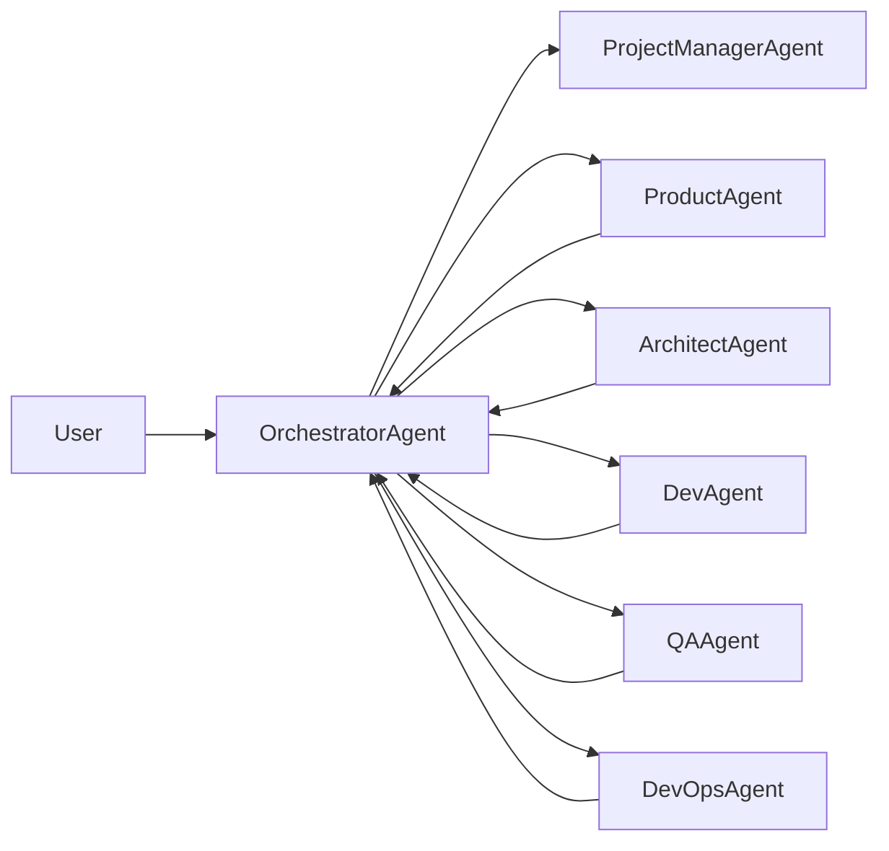

## 多智能体蜂群编排落地方案

### 一、背景与目标

- **背景**：本仓库的规范设计，已经将软件开发活动抽象为：
  - `process/`：阶段与流程；
  - `roles/`：角色与职责；
  - `mapping/phase-role-skill.yaml`：阶段-角色-skill 映射；
  - `skills/manifest.yaml` + 各 `skills/*/SKILL.md`：技能行为与 SOP；
- `state.yaml`：当前阶段与进展快照（**业务项目仓库内**）；规范仓库中的同名文件仅作 schema 示例/模板。
  - 以及 `process/project-docs/project-docs-index.yaml` 与 `process/artifact-metadata-convention.md` 对产出物的结构化约定。
- **目标**：在此基础上，将规范进一步抽象为一个**多智能体编排内核的配置中心**，设计一套可实现的“蜂群式多 Agent 编排方案”：
  - 由 Orchestrator Agent 统一解读规范与状态；
  - 多个 Role Agent 分别对应不同角色（产品、架构、开发、测试、DevOps 等）；
  - 通过标准化的任务/结果数据结构，实现“按阶段驱动的自动协作”，并为未来的工程实现提供规格参考。

本方案主要解决“如何用多智能体去执行这套规范”，而不绑定具体技术栈（LangGraph、Swarm、自研框架等均可参照）。

### 二、角色划分与 Agent 职责

#### 2.1 Orchestrator Agent（调度核心）

**职责定位**：Orchestrator 是“项目经理 + 调度器”的合体，但更偏技术角色，用来：

- 解析并加载规范：
  - 读取 `process/phases.yaml`：获得阶段列表与顺序；
  - 读取 `人类手册/process/process.md`：理解每个阶段的目标与完成条件；
  - 读取 `roles/roles.yaml`：获得角色池及其参与阶段；
  - 读取 `mapping/phase-role-skill.yaml`：确定阶段-角色-skill 映射；
  - 读取 `skills/manifest.yaml`：查找每个 skill 对应的 source 与说明；
- 读取**业务项目** `state.yaml`：获取当前阶段、已完成阶段等状态信息。
- 处理用户输入：
  - 接收用户的自然语言需求/问题；
  - 将其转化为结构化“项目上下文”与“阶段任务列表”（或更新现有项目状态）。
- 任务编排：
  - 在当前 `current_phase` 下，基于 mapping 决定需要激活哪些角色；
  - 为每个角色生成标准化任务（Task）并分派给对应 Role Agent；
  - 收集 Role Agent 的结果（Result），综合判断是否满足阶段完成条件。
- 状态与产出更新：
- 根据阶段完成条件更新**业务项目** `state.yaml` 中的 `current_phase`、`completed_phases`；
  - 视需要更新业务项目中的 `docs/project-docs-index.yaml`（例如记录文档路径、状态、更新时间等）。

Orchestrator 不直接写业务文档细节，而是负责**“谁在什么阶段做什么”**以及**“阶段是否可以推进”**。

#### 2.2 Role Agents（按角色拆分）

每个 Role Agent 与 `roles/roles.yaml` 中的一个或一组角色对应，例如：

- Product Agent：`product-manager` / `business-analyst`
- Architect Agent：`architect`
- Dev Agent：`developer` / `backend-developer` / `frontend-developer`
- QA Agent：`qa-engineer` / `test-engineer`
- DevOps Agent：`devops-engineer` / `sre`

每个 Role Agent 应具备以下能力：

- **理解自身职责与 SOP**：
  - 启动时读取 `roles/roles.yaml` 中自身角色定义；
  - 读取 `人类手册/roles/*.sop.md` 中的对应 SOP（如有）。
- **加载与执行技能**：
  - 根据 Orchestrator 下发的 `skill_name`，在 `skills/manifest.yaml` 中查找其 source；
  - 读取对应的 `SKILL.md`，将其中的步骤作为“可执行 SOP”；
  - 在执行时遵循 SKILL 中的输入/输出契约。
- **处理任务并产出结果**：
  - 接收 Orchestrator 下发的 Task（包含阶段、上下文、预期输出等）；
  - 读取业务项目的 `docs/project-docs-index.yaml`，定位/创建对应阶段产出物；
  - 根据 `process/artifact-metadata-convention.md` 写入/更新文档及 frontmatter；
  - 产出结构化 Result，返回给 Orchestrator。

### 三、任务（Task）与结果（Result）数据模型

为方便在不同技术栈中实现，建议抽象为与语言无关的 JSON 结构。

#### 3.1 Task 结构（给 Role Agent 的输入）

示例结构（伪 JSON）：

```json
{
  "task_id": "uuid",
  "project_id": "project-123",
  "phase_id": "prd",
  "role_id": "product-manager",
  "skill_name": "prd-requirements",
  "inputs": {
    "user_intent": "用户期望实现的业务目标、范围、约束等",
    "upstream_artifacts": [
      {
        "phase_id": "initiation",
        "type": "project-brief",
        "path": "docs/project-brief.md"
      }
    ],
    "project_docs_index_path": "docs/project-docs-index.yaml",
    "additional_constraints": {
      "performance": "...",
      "security": "...",
      "deadline": "..."
    }
  },
  "expected_outputs": {
    "artifacts": [
      {
        "type": "prd",
        "phase_id": "prd",
        "owner_role": "product-manager"
      }
    ],
    "need_summary": true,
    "need_risks": true,
    "need_open_questions": true
  }
}
```

关键字段说明：

- `phase_id`：阶段 id，与 `process/phases.yaml`、`state.yaml` 对齐；
- `role_id`：角色 id，与 `roles/roles.yaml` 对齐；
- `skill_name`：将在 `mapping/phase-role-skill.yaml` 与 `skills/manifest.yaml` 中出现；
- `inputs`：整合用户输入与上游产出物的上下文；
- `expected_outputs`：声明必须产出的文档/信息类型，方便 Role Agent 对齐交付。

#### 3.2 Result 结构（Role Agent 的输出）

示例结构（伪 JSON）：

```json
{
  "task_id": "uuid",
  "project_id": "project-123",
  "phase_id": "prd",
  "role_id": "product-manager",
  "status": "completed",
  "artifacts": [
    {
      "type": "prd",
      "path": "docs/product/prd-v1.md",
      "metadata": {
        "phase": "prd",
        "type": "prd",
        "status": "draft",
        "owner_role": "product-manager",
        "updated_at": "2026-03-10T12:00:00Z"
      }
    }
  ],
  "summary": "简要概述本次 PRD 的范围与关键决策。",
  "risks": [
    "对现有支付接口有兼容性风险，需架构师进一步评估。",
    "部分合规要求尚不明确，需与法律团队澄清。"
  ],
  "open_questions": [
    "是否必须支持多租户？",
    "是否需要对历史数据做迁移？"
  ],
  "recommendations_for_next_phase": [
    "建议进入 architecture 阶段，由 architect agent 评估架构与安全风险。",
    "建议 QA agent 在测试计划中重点覆盖三类风险场景。"
  ]
}
```

关键字段说明：

- `artifacts`：与 `docs/project-docs-index.yaml` 与 frontmatter 约定保持一致；
- `summary` / `risks` / `open_questions`：辅助 Orchestrator 与用户快速理解当前阶段产出质量；
- `recommendations_for_next_phase`：给 Orchestrator 提供“是否推进下一阶段”的参考信息。

### 四、阶段驱动与状态管理

#### 4.1 阶段状态机

Orchestrator 启动时，应将 `process/phases.yaml` 解析为一个有序状态机，例如：

- `initiation` → `prd` → `architecture` → `design` → `implementation` → `code-review` → `testing` → `release` → `operation` → `retrospective`

并将 `state.yaml` 中的 `current_phase` 与 `completed_phases` 映射到该状态机上，形成当前项目进度的内部表示。

#### 4.2 阶段内的角色激活

在某个 `current_phase` 下，Orchestrator 通过 `mapping/phase-role-skill.yaml` 查找需要激活的 `(role_id, skill_name)` 列表，例如：

- 在 `prd` 阶段：
  - `product-manager` 使用 `prd-requirements`；
  - `qa-engineer` 使用某个“需求可测性评审” skill；
  - 视需要调动 `project-manager` 做整体裁剪与计划。

Orchestrator 结合当前项目上下文（用户输入、既有文档、风险等），为每个 `(role_id, skill_name)` 生成 Task，并并行或顺序地分派给对应 Role Agent。

#### 4.3 阶段完成判定

阶段是否“完成”，可以由两部分共同决定：

1. **规范层面的完成条件**：
   - 写在 `process/phases.yaml` 或 `人类手册/process/process.md` 中，例如：
     - PRD 阶段：已存在状态为 `approved` 的 PRD 文档 + 已完成至少一次架构/测试可测性评审。
     - 测试阶段：关键测试集全部通过 + 主要风险已在测试报告中覆盖并评估。
2. **Orchestrator 层的策略判断**：
   - 汇总本阶段所有 Result 中的 `status`、`risks`、`open_questions`、`recommendations_for_next_phase`；
   - 若存在关键角色明确给出“不可推进”或“需人类决策”的结论，则暂停推进并向用户暴露这些信息；
   - 若所有关键角色均认为“满足完成条件且风险可接受”，则将 `current_phase` 推进到下一阶段，将本阶段 id 写入 `completed_phases`。

推进后，Orchestrator 可选择将新的（业务项目）`state.yaml` 写回业务仓库，或通过外部状态存储（数据库、配置中心等）进行持久化。

### 五、与项目文档和代码库的集成

#### 5.1 文档层集成

在文档层，Role Agents 应遵守以下约定：

- 所有阶段产出物路径，均以业务项目 **docs 目录**下的 `project-docs-index.yaml`（即 `docs/project-docs-index.yaml`）为“单一事实源”；
- 所有产出物文件顶部使用 YAML frontmatter，字段遵循 `process/artifact-metadata-convention.md`；
- Result 中汇报的 `artifacts[].path` 与 `metadata`，必须与实际文件保持一致；
- 如需新建文档，应在写入后协助更新 `docs/project-docs-index.yaml`（由 Role Agent 自己或通过 Orchestrator 完成）。

#### 5.2 代码与 CI/CD 集成（可选扩展）

在更进一步的落地中，可为 Dev / QA / DevOps Agent 增加与代码仓库和 CI/CD 系统的集成能力，例如：

- Dev Agent：
  - 基于架构设计与 PRD 生成代码变更方案；
  - 通过工具创建 feature 分支、提交代码、发起 PR（Pull Request）；
- QA Agent：
  - 根据 PRD 与架构信息生成测试计划与用例；
  - 触发自动化测试、解析测试报告并汇总；
- DevOps Agent：
  - 配置或修改 CI/CD 流水线；
  - 对环境需求、资源配额、安全与合规扫描结果进行解释与建议。

这些能力的具体实现依赖于外部系统（GitHub、GitLab、Jenkins、GitHub Actions 等），本方案只给出抽象职责，以便在不同技术栈中按需实现。

### 六、典型蜂群编排流程示例

以下以“从用户需求到上线”的简化流程为例，示意多 Agent 的协作。

#### 6.1 文本描述

1. **项目启动**：
   - 用户向 Orchestrator 描述一个新项目的目标与约束；
  - Orchestrator 初始化**业务项目** `state.yaml`，将 `current_phase` 设为 `initiation`；
   - 调度 Project-Manager Agent（或 Orchestrator 内部子逻辑）生成项目简要说明与初步阶段计划。
2. **PRD 阶段**：
   - Orchestrator 将 `current_phase` 切换为 `prd`，基于 mapping 激活 Product / QA 等角色；
   - 生成对应 Task，交由 Product Agent（编写/更新 PRD）、QA Agent（可测性评审）；
   - 收集 Result，若满足完成条件，则推进到 `architecture`。
3. **架构/设计阶段**：
   - Orchestrator 激活 Architect Agent、部分 Dev Agent；
   - 由 Architect Agent 基于 PRD 与既有系统信息给出架构方案与风险评估；
   - Dev Agent 可为方案可实施性、技术选型等提供补充意见；
   - 若架构评审通过，则推进到 `implementation`/`code-review` 等阶段。
4. **开发与代码评审阶段**：
   - Dev Agent 接收 Task，产生代码变更方案与实际代码；
   - Code-Review Agent（可以是独立 Role Agent，也可以由 Architect/资深 Dev 兼任）评审代码质量与风险；
   - Orchestrator 根据评审结果控制是否允许合并与进入测试阶段。
5. **测试与上线阶段**：
   - QA Agent 设计与执行测试用例，输出测试报告；
   - DevOps Agent 负责流水线执行、部署发布与回滚策略；
   - Orchestrator 依据测试结果与风险评估，决定是否进入上线阶段或要求回到前序阶段修正。

#### 6.2 Mermaid 流程图



### 七、实现建议与分阶段落地路线

考虑到多智能体系统实现成本较高，建议采用“自小到大”的分阶段路线：

1. **Phase 1：只自动化 PRD 阶段**
   - 实现 Orchestrator + Product Agent + QA Agent 的最小闭环；
   - 目标：从用户需求输入到“结构化 PRD 文档 + 风险与待澄清问题列表”的自动输出；
   - 使用已有的 `skills/prd-requirements`、`skills/prd-review` 作为 SOP 核心。
2. **Phase 2：加入架构与测试设计**
   - 将 Architect Agent 与测试设计相关的 QA Agent 纳入；
   - 目标：在 PRD 基础上自动生成“架构设计稿 + 测试计划/用例骨架”，并互相校验（架构可实现性 vs 测试可测性）。
3. **Phase 3：串联开发与 CI/CD**
   - 将 Dev Agent 与 DevOps Agent 纳入；
   - 目标：从设计到代码与流水线配置的“闭环建议”，最终能把“功能从想法送到可运行环境”。

在每个 Phase 中，都应优先保证：

- Orchestrator 对 `process/`、`roles/`、`mapping/`、`skills/`、`state.yaml` 的解析是稳定的；
- Task/Result 的数据模型与本方案中给出的结构保持一致或仅有可控扩展；
- 与业务项目中文档索引与元数据协议（`docs/project-docs-index.yaml` + frontmatter）保持完全一致。

### 八、与现有规范的映射关系总结

为避免实现时出现“概念漂移”，本节总结多 Agent 编排与现有规范之间的一一映射关系：

- **process/phases.yaml**：
  - 对应 Orchestrator 的“阶段状态机配置”；
  - `phases[].id` 与 `order` 映射到内部状态机节点与顺序。
- **人类手册/process/process.md**：
  - 对应各阶段的自然语言说明与完成条件；
  - Orchestrator 在判断阶段完成与是否推进时需参考其中描述。
- **roles/roles.yaml**：
  - 对应 Agent 角色池；
  - `roles[].id` 映射到 Role Agent 的 `role_id`。
- **人类手册/roles/*.sop.md**：
  - 对应人类视角的角色 SOP，亦可为 Role Agent 的“补充语义提示”；
  - 可在 Agent 初始化时读取，用于增强其角色感知与默认行为。
- **mapping/phase-role-skill.yaml**：
  - 对应“阶段-角色-skill 激活动作”的配置表；
  - Orchestrator 根据该表在每个阶段决定激活哪些 Role Agent 以及加载哪些 skill。
- **skills/manifest.yaml + skills/*/SKILL.md**：
  - 对应每个 Role Agent 可以使用的“可执行 SOP”集合；
  - SKILL 中的描述应被视为 Agent 内部推理与行动顺序的重要依据。
- **state.yaml**：
  - 对应整个项目的进展快照；
  - 在多 Agent 场景中，可作为 Orchestrator 与外界之间共享的状态存储。
- **process/project-docs/project-docs-index.yaml + process/artifact-metadata-convention.md**：
  - 对应文档层的“目录索引协议 + 元数据协议”；
  - Role Agent 与 Orchestrator 在处理业务项目文档时必须遵守。

通过以上映射，本方案将现有规范自然扩展为一套可实施的多智能体蜂群编排规格，既不强绑具体技术栈，也为未来的工程实现留出了足够空间。实现时只需围绕 Orchestrator + Role Agents + Task/Result 三个核心抽象，结合本仓库提供的配置与文档，即可构建出符合团队规范的多智能体协作系统。

